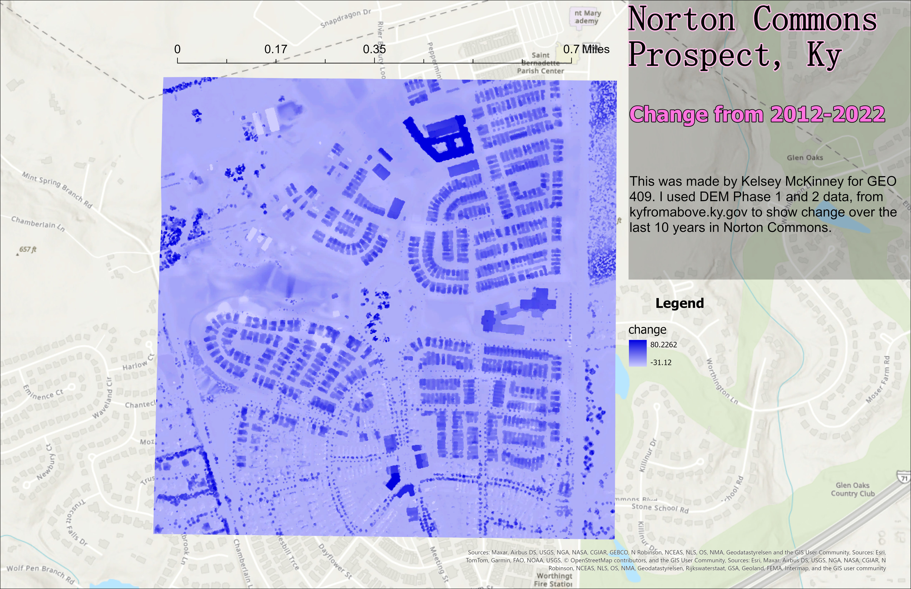

# Norton-Commons

## Norton Commons is located in Prospect, Kentucky. 

Norton Commons has changed a lot over the past ten years. New buildings and houses have gone up and has increased the population in that area. This map shows change in Norton Commons from 2012-2022.

  
_Norton Commons change from 2012-2022_

[Link to high-resolution version](ProspectLayout.pdf)

This project was created by Kelsey McKinney in GEO 409. I used DEM phase 1 and 2 layers to show change in Norton Commons. 